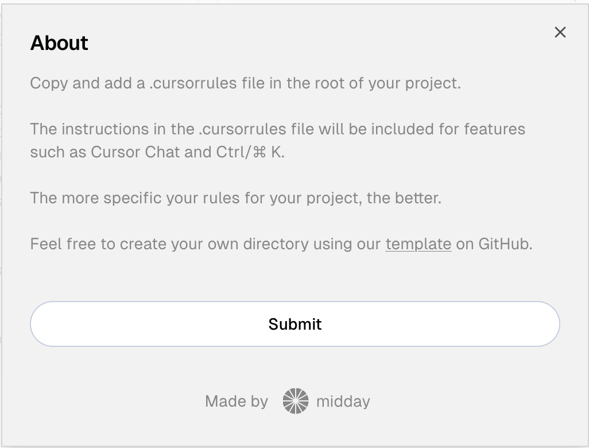

# Cursor Guide

### Introduccion
Cursor en un IDE centrado en IA, creado a partir de un  fork de VsCode.

Si bien es pago, tiene un modo free con ciertas funcionalidades al Mes

Al instalar busca las extensiones ya agradas al vsCode y las instala muy facilmente, haciendo una transicion muy rapida.

### v0
Antes de arrancar a desarrollar una solucion recomiendo empezar por v0 y luego llevarla a Cursor para seguir trabajando

[v0](https://v0.dev/chat) es una IA generativa que trabaja con React, Tailwind CSS y Shadcn UI entre otras techs

### Funcionalidades basicas

Algunas funcionalides basicas que solemos esperar de estas herramientas se encuentran disponibles como autocompletado 

Y lo pasibilidad de pedir generar codigo en base a lenguaje natural 

### Modo seleccion de codigo

Asi como otras herramientas del estilo existe la posiblidad de trabajar con codigo seleccionado. 
Command / Ctrl + K es la forma de activar el chat
	

### Explicacion de Codigo 

Otra funcionalidad tipica que vamos a encontrar en Cursor es la explicacion de codigo 

### Modelos 

### Tip 1 -- Code Search 

Una de las funcionalidades muy utilies de cursor al trabajar con proyectos grandes en la habilidad de encontrar una pieza de codigo rapidamente por medio de consultas a la IA

En este ejemplo podemos ver como un usuario pregunta por la funcion de direcciones de navegacion y seleccion el scope del proyecto completo

La IA responde su ubicacion, muestra un framento del mismo que al clickear automaticamente te lleva al archivo correspondiende 

### Tip 2 - - Chat Integrado

Asi como otras herramientas de generacion de codigo con IA, Cursor tiene un chat con la habilidad de generar codigo a pedido, pero creo que aca Cursor destaca por no solo generar codigo si no mantener el contexto a lo largo de la conversacion, poder seleccionar el modelo para el chat y tambie la facilidad de aplicar el codigo sobre nuestro proyecto sea copiendolo o aplicandolo directamente

Aca podemos ver las posibilidades sobre el chat 

### Tip 3  - - Comandos de Referencia @

Existen diferentes tipos de comandos para referenciar en Cursor, existe el comando [@Files](https://docs.cursor.com/context/@-symbols/@-files) y [@Folder](https://docs.cursor.com/context/@-symbols/@-folders) para referenciar tanto archivos como Carpetas

El comando [@Code](https://docs.cursor.com/context/@-symbols/@-code) para referenciar un framento de codigo puntual 

Otro de los comandos que se pueden usar al hablar sea por Chat o Composer en Cursor es la referencia a docs con el commando [@Docs](https://docs.cursor.com/context/@-symbols/@-docs)

Este comando permite hacer referencia a documentacion oficial de la Web para que la IA tenga en su contexto el contenido, por ejemplo si estamos pidiendo alguna implementacion sobre Angular podria antes de hablar con la IA usar el siguiente comando

`@Docs https://v17.angular.io/docs`

Esto asegura no solo que la IA contemple informacion al dia de angular, usando informacion en este caso de la v17 si no que tambien nos ayuda a generar codigo segun los estandares oficiales. 

Cursor ya tiene cargadas algunas documentaciones oficiales pero con solamente el link podemos agregar todas las que necesitemos

Asi mismo con el comando [@Web](https://docs.cursor.com/context/@-symbols/@-web) podemos referenciar una web cualquiera, sea para usar de referencia a modo de UI, para usar el contenido o algun otro uso que le encontremos 

Otra forma de usar esta funcionalidades es con el comando [@Git](https://docs.cursor.com/context/@-symbols/@-git) especificamente pensado para referenciar codigo alojado ahi

En el chat de cursor podes tipear [@Git](https://docs.cursor.com/context/@-symbols/@-git) para agregar commits, diffs, pull request o repositorios completos

Tambien podes usar `@Diff of Working State` para generar un mensaje de commit en base al diff. 

Algunos otros comandos interesantes

### Tip 4 - - Generar codigo en base a imagenes

Si bien tal vez v0 puede una mejor alternativa para esto cursor permite tambien la posiblidad generar codigo en base a una imagen 

### Tip 5  - - Prompt Loading

Existe este sitio https://cursor.directory/
EN el cual hay una lista de prompst pensados para diferentes contextos y tecnologias, esto se puede incorporar a cursor para que lo tenga en cuenta a la hora de hacer cualquier consulta 

Ademas el sitio tiene una seccion de guias de cursor muy bien curada 

### Tip 6 - - Composer

El composer es una feature aun en Beta pero que esta pensada para generar codigo por medio de IA cuando queremos hacer algo grande, que implique multiples archivos y no sea viable hacerlo por chat. 
Esto es algo que muchas otras tools aun no tienen y suelen estar pensadas para generacion de codigo mas fragmentada

La feature se activa desde settings

Y permite algunas configuraciones interesantes

### Referencias 
*  https://www.youtube.com/watch?v=yk9lXobJ95E
*  https://www.youtube.com/watch?v=Tm_2RZm8JB8
*  https://www.youtube.com/watch?v=sCFS_U7d9Do