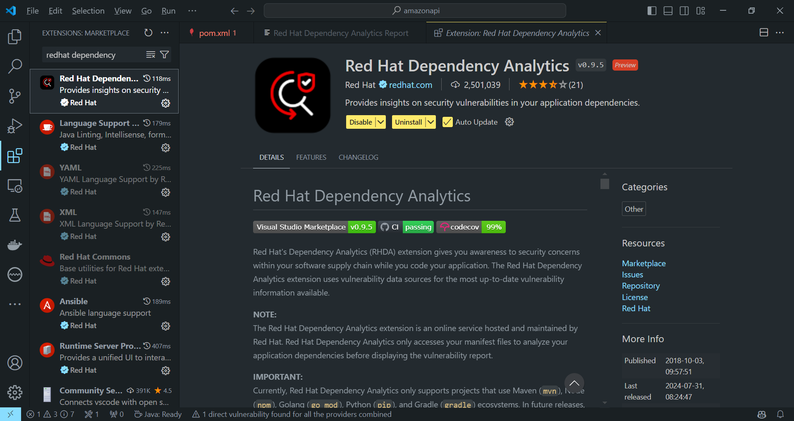

# Redhat Dependency Analitycs

La extensión **Dependency Analytics (RHDA)** de Red Hat te ayuda a identificar problemas de seguridad en el ciclo de vida de software mientras desarrollas la aplicación. Esta herramienta utiliza bases de datos de vulnerabilidades para ofrecerte la información más actualizada sobre posibles riesgos de seguridad.

### Soporte del plugin IDE

El plugin IDE de análisis de dependencias está disponible para VS Code, Eclipse y cualquier IDE de JetBrains, incluidos IntelliJ y PyCharm.

Esta extension permite desde el IDE realizar una analisis de vulnerabilidades sobre las dependencias que estemos usando en el “pom.xml”

### Instalacion

La extension es sencila de agregar, simplemente buscamos en el Marketplace de Extensiones “Redhat Dependency Analitycs”

Veamos un ejemplo:

Ahi podemos ver que la dependencia de la base de datos H2 tiene algun alerta

Le damos Clic con boton derecho sobre el area de trabajo del pom.xml y seleccionamos del menu contextual la opcion de Redhat Dependency Analytics Report

Realiza un escaneo en la base de conocimiento

Luego de unos segundos nos devuelve el analisis realizado

Buscamos abajo la que estaba alertada

Desplegamos la que dice Direct Vulnerabilities / Remediation

Alli nos lleva a la Base de conocimientos y su solucion

En este caso es necesario especificar una version 2.2.220 o posterior de H2 Database Dependency

Se puede configurar manual o tambien ayudarse de Copilot

Como Copilot sugiere una modificacion por debajo unicamente modificamos el valor de la version

Agregamos 2.2.220

Ahi vemos que dejo de alertar

Todo este proceso permite adelantarse a las vulnerabilidades que pueden surgir en los Stages de Analisis de Dependencias de los Pipelines de CI/CD